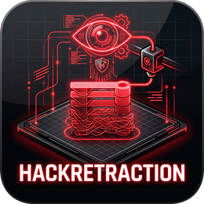
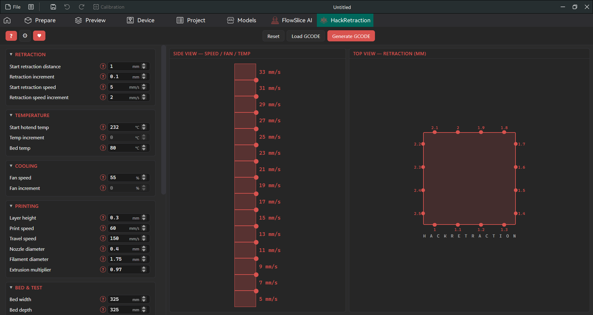
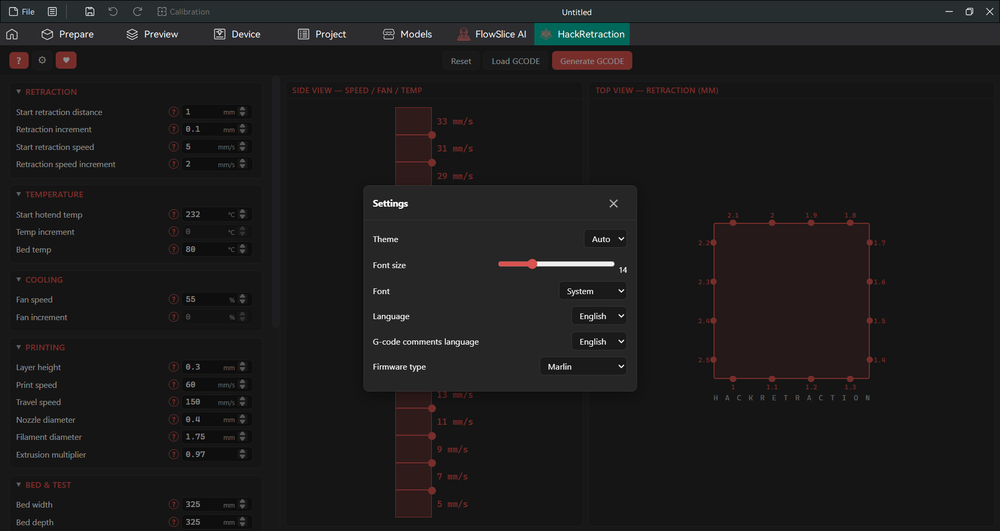
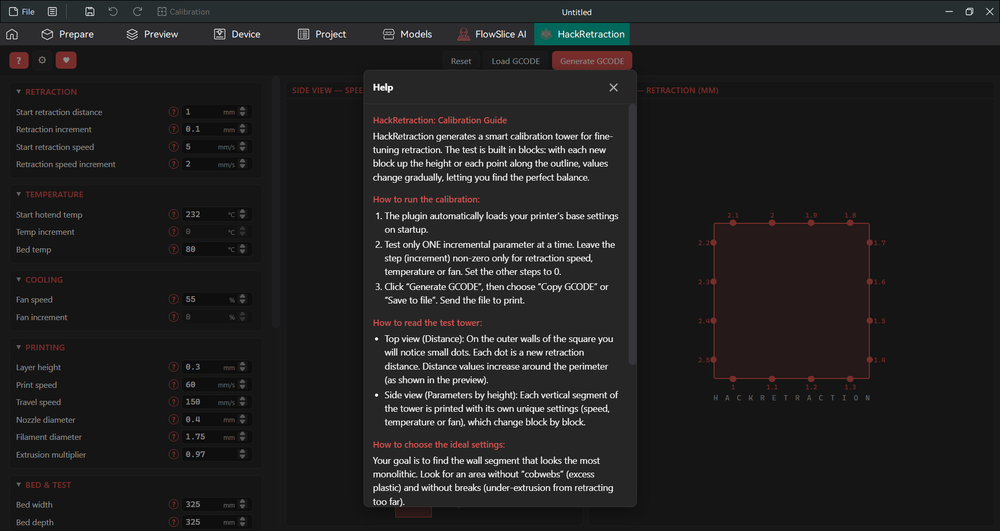

# HackRetraction

  

  <b>Умная калибровочная башня для точной настройки ретракции прямо внутри Orca Slicer.</b> 
  Генерирует G-code теста: дистанция втягивания растёт по периметру, скорость / температура / обдув — по высоте. 
  Рекомендованные параметры под выбранный профиль рассчитываются автоматически.

  
  
  
  

---

## 🧐 Что это такое

**HackRetraction** — плагин для [Orca Slicer](https://github.com/OrcaSlicer/OrcaSlicer), который строит
калибровочную башню для настройки ретракции. Тест собирается блоками: с каждым новым блоком по высоте
или точкой на контуре значения плавно меняются, позволяя найти идеальный баланс между «паутиной»
(излишек пластика) и недоэкструзией (слишком большое втягивание).

## ✨ Возможности

- **Генерация G-code** калибровочного куба: дистанция втягивания увеличивается по периметру
  (точки на стенках), скорость / температура / обдув меняются по высоте блоками.
- **Подтягивание параметров из профиля** (кнопка «Подтянуть параметры»): диаметр сопла, размеры
  стола, высота слоя, коэффициент потока, скорости печати и перемещения, температуры, стартовый и
  конечный G-code принтера. Определяется тип экструдера (bowden/direct) для стартовых значений.
- **Рекомендованные параметры**: под выбранный профиль по умолчанию предлагаются оптимально
  рассчитанные значения — можно сразу генерировать башню.
- **Живое превью**: вид сверху (значения втягивания по периметру квадрата) и вид сбоку (башня блоков
  с параметрами) — обновляется мгновенно при изменении любого поля.
- **Блокировка шагов**: инкрементальный шаг можно задать только для одного параметра из трёх
  (скорость втягивания / температура / обдув); остальные поля блокируются с пояснением в тултипе.
- **Экспорт**: после «Сгенерировать GCODE» — выбор «Скопировать в буфер» или «Сохранить в файл».
  Ранее сгенерированный G-code можно загрузить обратно — параметры восстановятся автоматически.
- **Встроенная помощь**: красная кнопка «?» открывает пошаговое руководство по калибровке и чтению
  башни — достаточно информации, чтобы провести тест без внешних инструкций.
- **Настройки**: тема (auto/тёмная/светлая), размер и шрифт, язык интерфейса (RU/EN/SR),
  язык комментариев в G-code.
- **Уведомления-тосты**: результат каждого действия (генерация, сохранение, ошибки) показывается
  аккуратным всплывающим уведомлением в правом верхнем углу.

## 📸 Скриншоты

  Главный экран: параметры слева, живое превью (вид сверху и сбоку) справа:
   

  Настройки: тема, шрифт, язык интерфейса и комментариев:
   

  Встроенная помощь — пошаговое руководство по калибровке:
   

## 📦 Установка

### Способ 1. Через OrcaCloud (рекомендуется)

1. Откройте [страницу HackRetraction в OrcaCloud](https://cloud.orcaslicer.com/p/XXXXXXXX).
2. Оформите подписку на **HackRetraction**.
3. После подписки плагин появится в Orca Slicer в разделе **File → Plugins** — установите его.

### Способ 2. Локальная установка `.whl`

1. Скачайте файл `hackretraction-<версия>-py3-none-any.whl` со страницы
   [**Releases**](https://github.com/FlowHack/HackRetraction/releases).
2. Поместите его в `data_dir()/orca_plugins/` и перезапустите OrcaSlicer.

> `data_dir()` — папка конфигурации OrcaSlicer. В Windows обычно `%APPDATA%\OrcaSlicer`;
> открыть её можно через **File → Configuration folder**.

## 🚀 Запуск

1. Откройте диалог плагинов: **File → Plugins**.
2. Установите флажок (чекбокс) слева от **HackRetraction** — вкладка плагина появится
   на основном экране OrcaSlicer.
3. Когда настройка принтера выполнена, плагин можно скрыть: снова откройте
   **File → Plugins** и снимите флажок.

## 🛠️ Использование

1. Нажмите **«Подтянуть параметры»**, чтобы загрузить базовые настройки вашего принтера
   (плагин подгружает их при запуске, но если этого не произошло — нажмите кнопку).
2. Тестируйте только **ОДИН** инкрементальный параметр за раз. Оставьте шаг (прирост) отличным
   от нуля только для скорости втягивания, температуры **или** обдува. Остальные шаги установите в 0.
3. Нажмите **«Сгенерировать GCODE»** и выберите: **«Скопировать в буфер»** или **«Сохранить в файл»**
   (укажите путь в появившемся диалоге).
4. Отправьте G-code на печать. Если что-то непонятно — нажмите красную кнопку **«?»**: встроенная
   помощь объяснит, как провести калибровку и как читать башню.

### 🔍 Как читать тестовую башню

- **Вид сверху (дистанция):** на внешних стенках квадрата — точки. Каждая точка — новая дистанция
  втягивания; значения увеличиваются по периметру.
- **Вид сбоку (параметры по высоте):** каждый вертикальный сегмент башни печатается со своими
  уникальными настройками (скорость, температура или обдув), которые меняются блок за блоком.

Ваша цель — найти сегмент стенки, который выглядит максимально монолитно: без «паутины» (излишек
пластика) и без разрывов (недоэкструзия из-за слишком большого втягивания). Идеальная дистанция —
значение у конкретной точки на этом участке; идеальная скорость/температура/обдув — параметры того
высотного блока, на котором находится эта точка.

## ⚖️ Лицензия

Проект распространяется под лицензией **AGPL-3.0**. См. файл [`LICENSE`](LICENSE).

  Сделано с ❤️ для сообщества 3D-печати. 
  <b>HackRetraction</b> — печатайте с умом.

